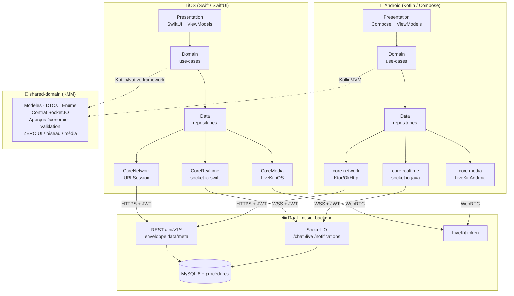

# Architecture — Dual Music Mobile

## Vue d'ensemble

## Principes

1. **Clean Architecture** — 4 couches identiques sur les 2 plateformes : Presentation →
   Domain → Data → Infrastructure. Les dépendances pointent vers le Domain.
2. **shared-domain (KMM)** — uniquement le *quoi* (modèles, contrats, validation,
   aperçus d'affichage). Jamais le *comment* (UI, réseau, média = 100 % natif).
3. **Argent** — les montants qui font foi viennent du backend (procédures atomiques). Le
   mobile n'affiche que des aperçus et lit les soldes/nets via l'API.
4. **Realtime** — Socket.IO, un client par plateforme, contrat partagé dans
   `shared-domain/realtime`.

## Conventions transverses (posées par cette fondation)

- **Enveloppe API** : succès `{ data, meta }`, erreur `{ error:{ code, message, details } }`.
  Décodée une seule fois dans `core-network`, qui renvoie soit `data`, soit lève `ApiError`.
- **Auth** : `TokenStore` (protocole) fournit access/refresh ; `core-network` gère le
  refresh **single-flight** sur 401 puis rejoue la requête.
- **Erreurs** : type `ApiError` typé (statut HTTP + `code` métier), branchables par l'UI.
- **Realtime** : `RealtimeContract` (namespaces, `roomName(type,id)`, catalogue d'events)
  est la référence unique partagée iOS/Android.
